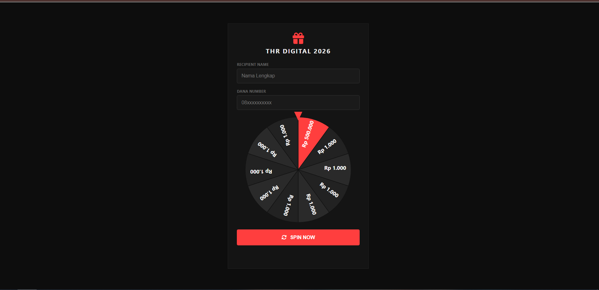
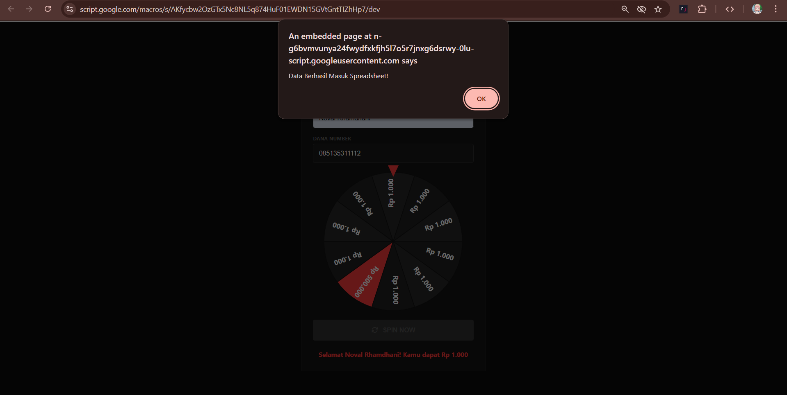

# THR Digital 2026 - Lucky Wheel System

Sistem undian digital berbasis web yang dirancang untuk pembagian THR (Tunjangan Hari Raya). Aplikasi ini menggunakan Google Apps Script sebagai backend dan Google Sheets sebagai basis data untuk mencatat setiap transaksi pemenang secara real-time.

## Fitur Utama

- Interface responsif dengan tema minimalis gelap.
- Sistem roda keberuntungan menggunakan SVG untuk presisi visual yang maksimal.
- Integrasi langsung dengan Google Sheets untuk pendataan pemenang.
- Logika probabilitas yang dapat disesuaikan (Default: 10% Jackpot Rate).
- Validasi input untuk Nama Penerima dan Nomor Akun DANA.

## Teknologi Yang Digunakan

- **Frontend**: HTML5, CSS3 (Modern Flexbox), JavaScript (Vanilla JS).
- **Graphics**: Scalable Vector Graphics (SVG) untuk elemen roda.
- **Backend**: Google Apps Script (V8 Engine).
- **Database**: Google Sheets API.
- **Icons**: FontAwesome 6 (CDN).

## Cara Instalasi

Untuk menjalankan proyek ini di lingkungan Google Apps Script:

1. Buat Google Sheets baru di Drive Anda.
2. Buka menu **Extensions** > **Apps Script**.
3. Salin kode dari file `Code.gs` ke dalam editor script.
4. Buat file baru di editor Apps Script dengan nama `Index.html` dan salin kode interface ke sana.
5. Simpan proyek dengan menekan tombol simpan.
6. Klik tombol **Deploy** > **New Deployment**.
7. Pilih jenis **Web App**.
8. Ubah akses "Who has access" menjadi **Anyone**.
9. Salin URL Web App yang dihasilkan untuk dibagikan.

## Struktur Data Spreadsheet

Aplikasi akan secara otomatis menambahkan baris baru dengan format kolom sebagai berikut:

| Timestamp | Nama Penerima | Nomor DANA | Hadiah |
|-----------|---------------|------------|--------|
| Waktu Selesai | Input User | Input User | Hasil Spin |

## Konfigurasi Logika

Logika kemenangan diatur pada fungsi `mulaiSpin()` di dalam file `Index.html`. Secara default, sistem menggunakan perhitungan `Math.random()` dengan ambang batas 10% untuk hadiah utama (Rp 500.000) guna memastikan distribusi hadiah tetap terkontrol bagi admin.

## Lisensi

Proyek ini dibuat untuk tujuan edukasi dan penggunaan pribadi selama masa Lebaran. Segala bentuk penyalahgunaan di luar tanggung jawab pengembang.

## DEMO
---
LINK : <a href="https://script.google.com/macros/s/AKfycbzbIpXXunqu6A5tREC_0d5uT4yVZ33w9QUTkf5yZbJNvFfhEnx-nReuuziclYVYWGQ8/exec">DEMO</a>
---
</img>
</img>
